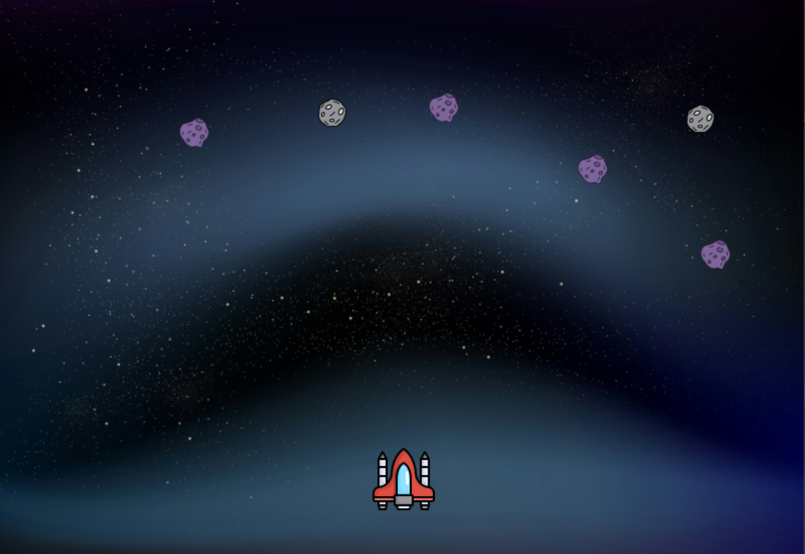

# 🚀 Asteroid Attack

A retro-style 2D space shooter game built with **Pygame**, where the player pilots a spaceship and must destroy falling asteroids. Navigate through multiple levels, destroy asteroids, and aim for the high score!

---

## 🎮 Features

- Simple game states: menu, playing, pause, game over

- Gets harder over time: more asteroids, faster speeds as you score

- Asteroids feel alive: drift sideways, sometimes chase you, wrap around screen, change     direction

- Smart spawning: asteroids appear randomly but never too many at once

- Player moves left/right and can’t leave the screen

- Shoot lasers: they fire up and disappear off-screen

- Collisions: lasers hit asteroids, score goes up, boom sound

- Screen shakes when asteroids hit the bottom

- Lives system shown as hearts

- Score + high score saved between runs

- Background changes as your score increases

- Sound: music loop, laser/explosion sounds, safe audio setup

- UI screens: clickable menu, pause screen, game over with restart

- Controls: arrows move, space shoots, ESC pauses, M mutes, E restarts